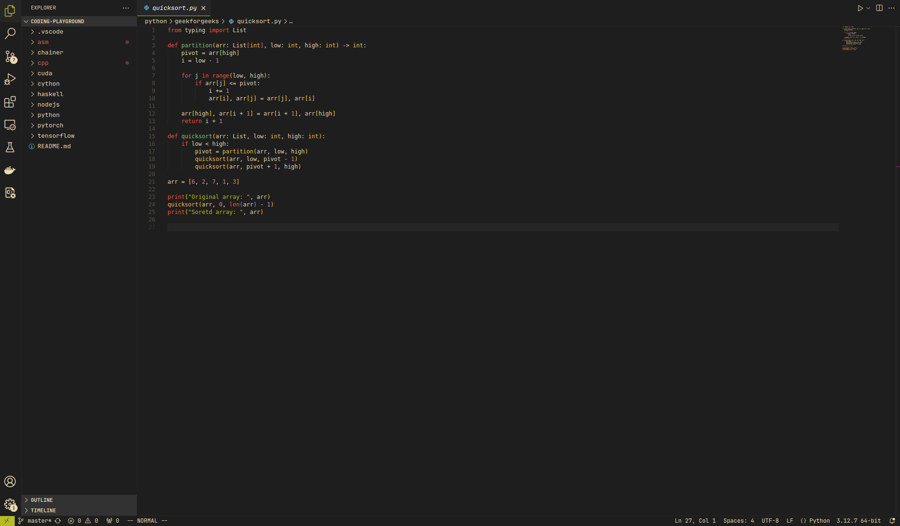

# Codely Visual Studio Code Theme (No Italic)

This repository contains a modified version of the [Codely theme](https://github.com/CodelyTV/vscode-theme) for Visual Studio Code.

All credits go to the original author(s). I just wanted a modified version of the theme without the italic font style. :-)

# Screenshot

    

# License

Please check [LICENSE.md](LICENSE.md) for more information.